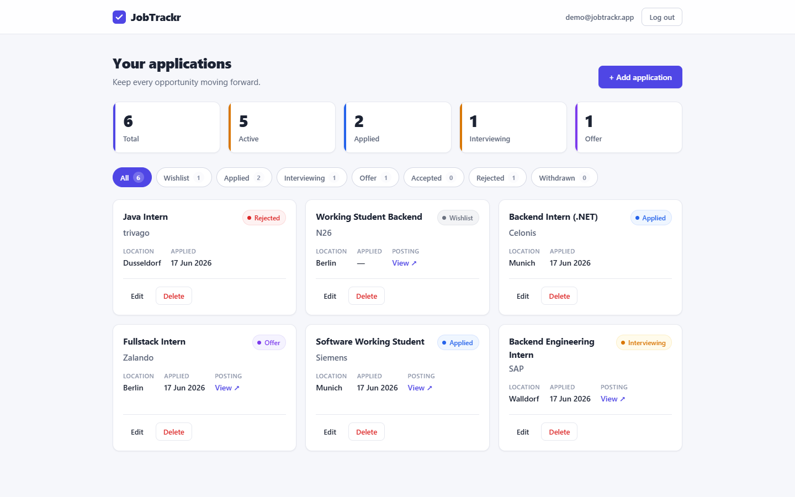
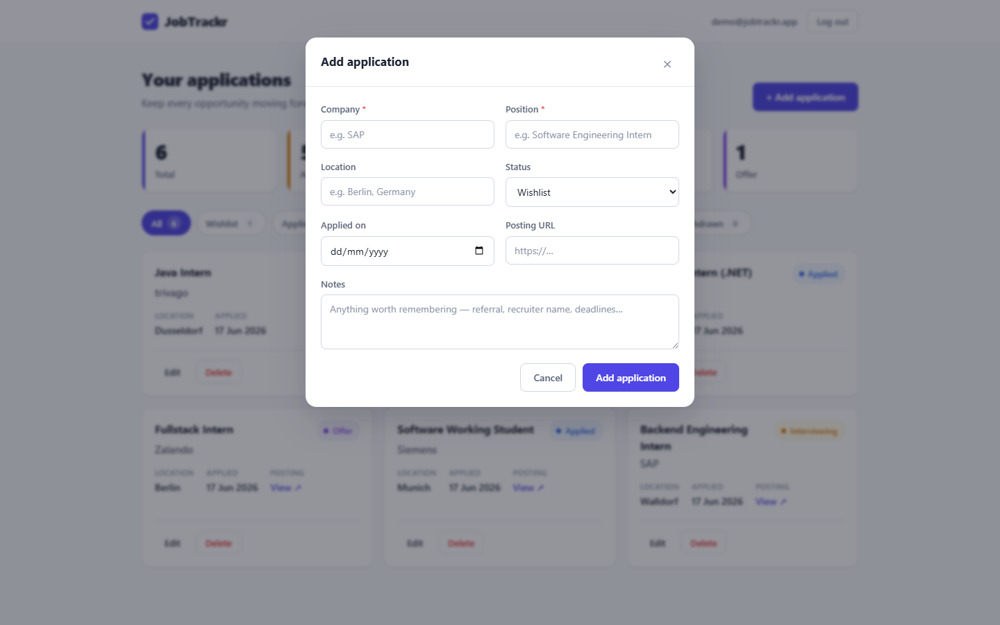

# JobTrackr

[](https://github.com/MohammadAlfalah/jobtrackr/actions/workflows/ci.yml)


A full-stack web app for tracking internship and job applications from *wishlist* all the way to *offer accepted*.

I built this while running my own search for a software-engineering internship in Germany. I was managing it all in a spreadsheet, and the spreadsheet kept letting me do things that made no sense — marking something "interviewing" after I'd already been rejected, losing track of which applications were still live. I wanted a real tool: proper login so my data is private, a status flow that won't let me record nonsense, and a dashboard that tells me at a glance where the search actually stands. It's also where I put the full loop together — a typed REST API, JWT auth, a React SPA, tests, and a containerised dev setup — in one repo.

## Screenshots

| Dashboard | Add / edit application |
|---|---|
|  |  |

## What it does

- Register and log in. Every request is scoped to the signed-in user, so your applications are yours alone.
- Track each application: company, position, location, status, applied date, a link to the posting, and free-text notes.
- Move applications through a real status flow — `Wishlist → Applied → Interviewing → Offer → Accepted`, with `Rejected` and `Withdrawn` as exits. The API rejects illegal jumps (e.g. `Rejected → Interviewing`), so the numbers stay trustworthy.
- See dashboard stats: totals, how many are still active, and a per-status breakdown.
- Filter the list by status.

## The bit I cared most about: the status workflow

This is the core rule of the app, and I deliberately kept it in one small, readable file — [`StatusWorkflow.cs`](backend/JobTrackr.Api/Services/StatusWorkflow.cs) — instead of scattering `if` checks around. Modelling the hiring process as an explicit state machine is what keeps the data honest; the dashboard stats only mean something if the transitions mean something.

```
Wishlist     → Applied, Withdrawn
Applied      → Interviewing, Offer, Rejected, Withdrawn
Interviewing → Offer, Rejected, Withdrawn
Offer        → Accepted, Rejected, Withdrawn
Accepted / Rejected / Withdrawn → (terminal)
```

Controllers stay thin; the interesting logic — the state machine and the per-user scoping — lives in a service layer that's unit-tested without spinning up a web server or a real database.

## Tech stack

| Layer | Technology |
|---|---|
| Frontend | React 19 + TypeScript (Vite), plain CSS |
| Backend | ASP.NET Core 10 Web API (C#) |
| Auth | JWT bearer tokens, BCrypt password hashing |
| Data | EF Core 10 + SQLite (zero-config — clone and run) |
| Tests | xUnit, with EF Core against SQLite |
| Tooling | Docker / Docker Compose, GitHub Actions |

SQLite was a deliberate choice: no database server to install, the schema ships as an EF migration, and the file is created on first run. Clone it and it just works.

## Running it

### Docker (the easy way)

Needs Docker Desktop.

```bash
docker compose up --build
```

Then open **http://localhost:8080**, register an account, and start adding applications. (Set `WEB_PORT=9090 docker compose up` if 8080 is taken.)

### Running the two apps by hand

Backend — needs the .NET 10 SDK:

```bash
cd backend/JobTrackr.Api
dotnet run
# API on http://localhost:5077, Swagger UI at http://localhost:5077/swagger
```

Frontend — needs Node 20+:

```bash
cd frontend
npm install
npm run dev
# Web app on http://localhost:5173, dev server proxies /api to the backend
```

## API at a glance

Everything under `/api/applications` needs an `Authorization: Bearer <token>` header.

**Auth — `/api/auth`**

| Method | Route | Body | Notes |
|---|---|---|---|
| `POST` | `/register` | `{ email, password }` | Creates an account, returns `{ token, email }`. |
| `POST` | `/login` | `{ email, password }` | Returns `{ token, email }`. |

**Applications — `/api/applications`**

| Method | Route | Notes |
|---|---|---|
| `GET` | `/?status={status}` | List your applications, optional status filter. |
| `GET` | `/stats` | Dashboard summary (`total`, `byStatus`, `activeCount`). |
| `GET` | `/{id}` | One application. |
| `POST` | `/` | Create. |
| `PUT` | `/{id}` | Update — an illegal status change comes back as `400` with an explanation. |
| `DELETE` | `/{id}` | Delete. |

## Tests

```bash
cd backend
dotnet test
```

The tests cover the status-transition rules, per-user isolation (one user can never read or edit another user's applications), the applied-date stamping, and the dashboard stats. The transition rules are driven by xUnit theories, so each allowed/disallowed pair is checked individually.

## Repo layout

```
jobtrackr/
├─ backend/
│  ├─ JobTrackr.Api/    ASP.NET Core API — controllers, services, EF Core, auth
│  ├─ JobTrackr.Tests/  xUnit tests
│  └─ Dockerfile
├─ frontend/            React + TypeScript (Vite) SPA
├─ .github/workflows/   CI: builds + tests the backend, builds the frontend
└─ docker-compose.yml
```

## What I'd add next

- Reminders / follow-up dates for applications still waiting on a response.
- CSV / JSON export.
- Tags and full-text search over notes.
- A live demo deployment.

## License

MIT — see [LICENSE](LICENSE).
